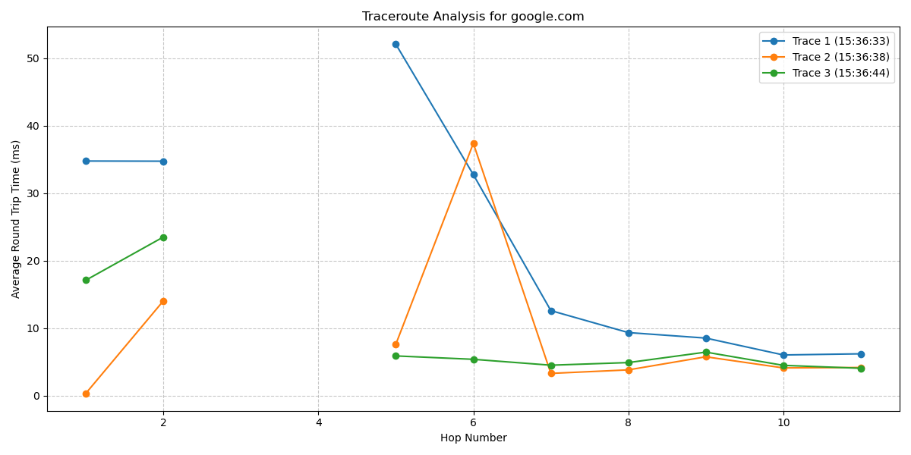

[](https://classroom.github.com/open-in-codespaces?assignment_repo_id=18567484)



# The Amazing Trace

The ultimate path tracer

## Features

- Trace packet hops across the internet to any destination
    - Supports hostnames and IP addresses
- Visual data in the form of line graphs
- Multiple traces
    - Three traces per hostname for consistency

## How to use

1. After [installation](#installation), run `python3 amazing_trace.py` to run *The Amazing Trace* with its default settings, which are to trace *google.com*, *amazon.com*, and *bbc.co.uk*
2. To change the websites that are traced, open `amazing_trace.py` and scroll to the bottom. It should look something like this:
```
if __name__ == "__main__":
    # Test destinations
    destinations = [
        "google.com",
        "amazon.com",
        "bbc.co.uk"  # International site
    ]

    for dest in destinations:
        df, plot_path = visualize_traceroute(dest, num_traces=3, interval=5)
        print(f"\nAverage RTT by hop for {dest}:")
        avg_by_hop = df.groupby('hop')['avg_rtt'].mean()
        print(avg_by_hop)
        print("\n" + "-"*50 + "\n")
```
You may add, remove, and change any value in the `destinations` list to affect what locations are traced by the program

## Installation

1. Make sure you have python installed
2. Install the `pandas` and `matplotlib` modules
3. Clone the repository into your directory of choice